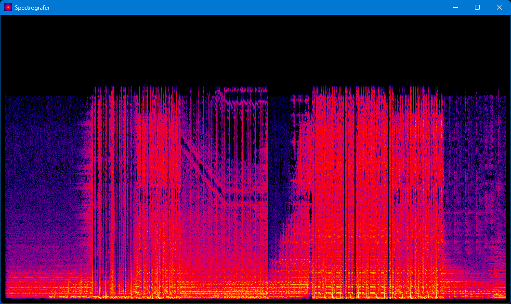

# spectografer

A spectogram visualization tool built with C++23.

> [!NOTE]
> This is a poor attempt at replicating [Spek](https://www.spek.cc/)

## Tools

1. Conan - Dependency Manager
2. CMake - (Meta-)Build System

## Dependencies

1. raylib - Graphics handler
2. fftw - Fast Fourier Transform implementation
3. libsndfile - Audiofiles handler

## How to run

Before running make sure Conan and CMake are installed on your system.

1. Clone the repository
2. Run dependency install, build and run scripts:

    ```bash
    ./install.sh # installs dependencies using conan
    ./build.sh # builds project in Release mode using cmake file generated by conan
    ./run.sh # runs the generated executable (Windows)
    ```

3. Drag-and-drop the audiofile you want to visualize


